

  
  <h3 align="center">Medication Reminder App</h3>

Best Medication Reminder App

  A medication reminder and tracking app that makes it easier for users (especially the elderly and those with chronic conditions) to adhere to their medication routine through reliable alerts, a clear interface, and the ability to share schedules with family and doctors.

## Screenshots

  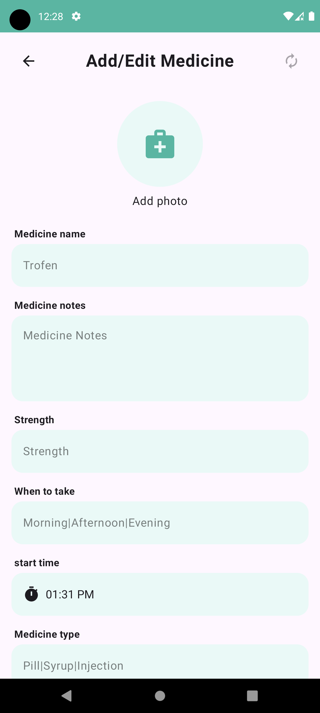
  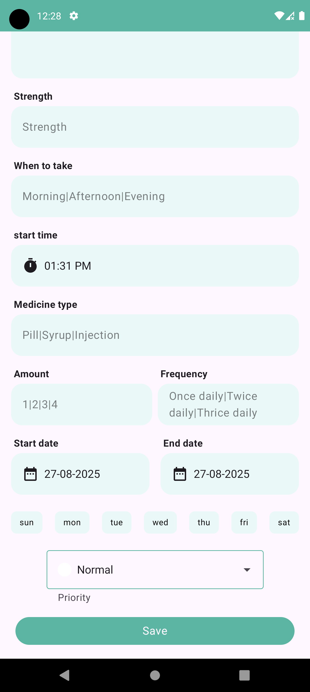
  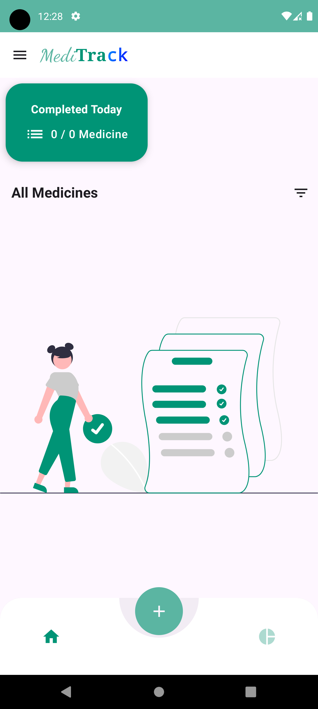
  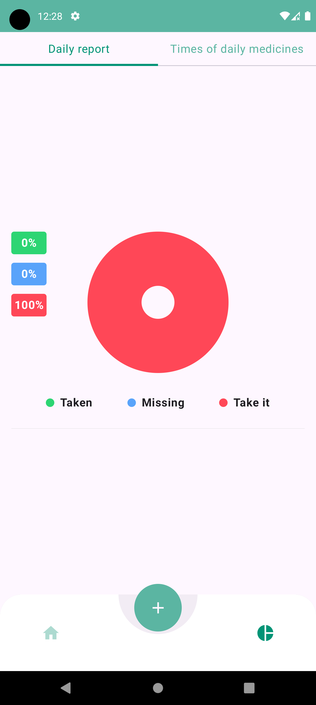
  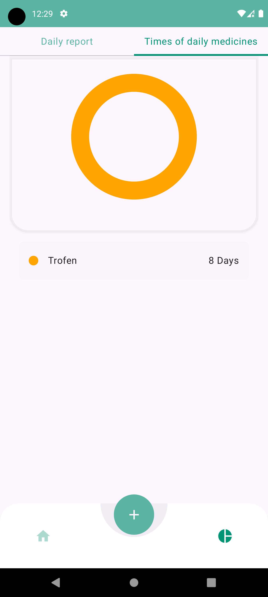
  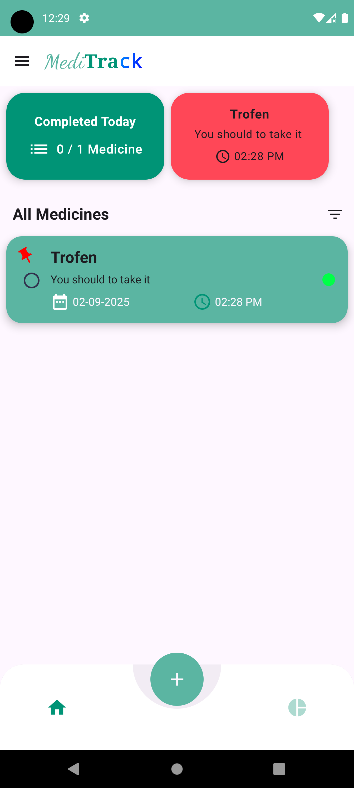
  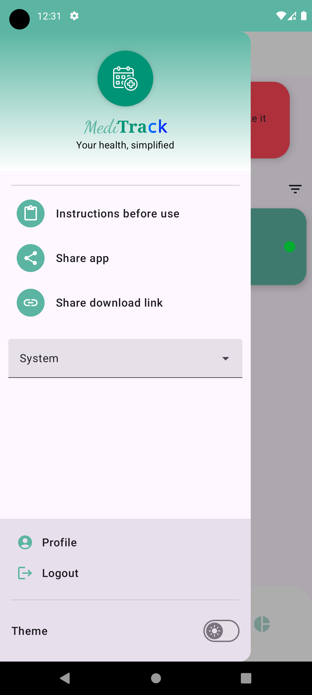
  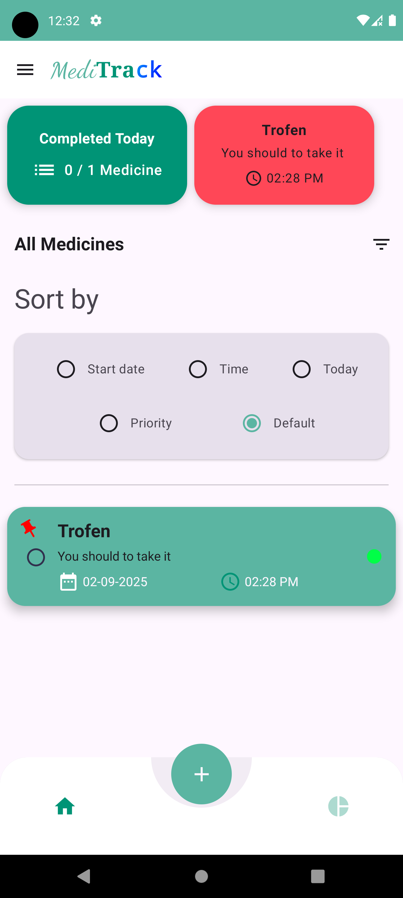
  
  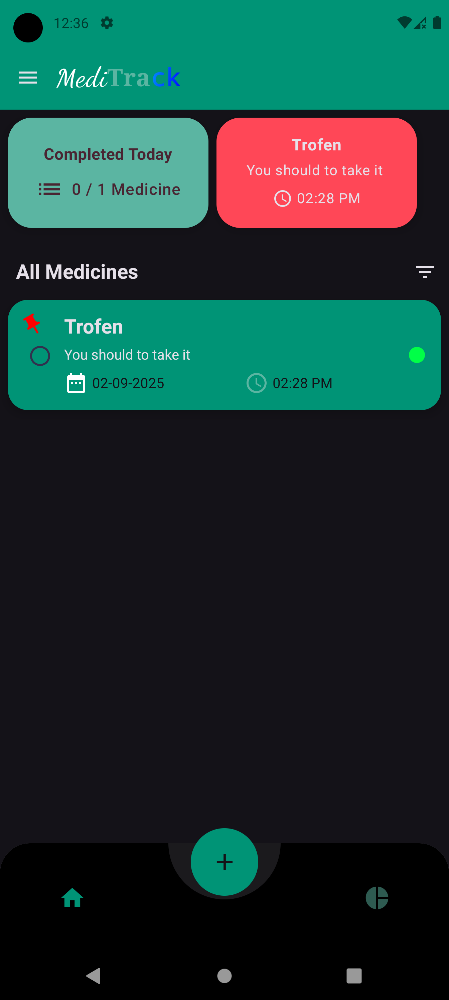
  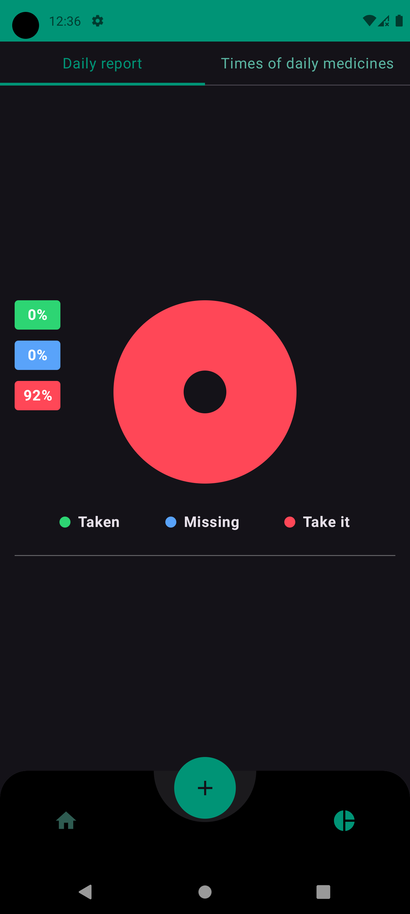
  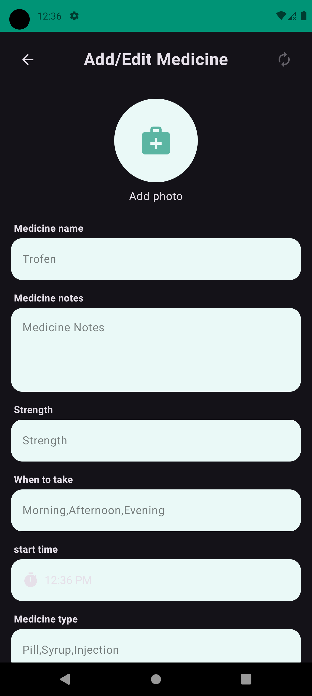

<a href="https://drive.google.com/file/d/1fFaSRDJ0lcOTYglQCBpepjVlQXGehy5E/view?usp=sharing" > Download My App</a>

## Tools and Libraries Used

- Language: Kotlin
- Framework: Android Jetpack Compose
- Image Loading: Glide
- Dependency Injection: Hilt
- Asynchronous Programming: Coroutines, Flow
- Android Architecture Components: MVVM, ViewModel
- Backend: Firebase

  
  
  
  
  

## Setup and Installation

1. Clone the repository: `git clone https://github.com/Navneet851/spotify-clone-jetpack-compose.git`
2. Build and run the project on an emulator or actual device

## Contributing

Pull requests are welcome. For major changes, please open an issue first to discuss what you would like to change.# music-player-compose
