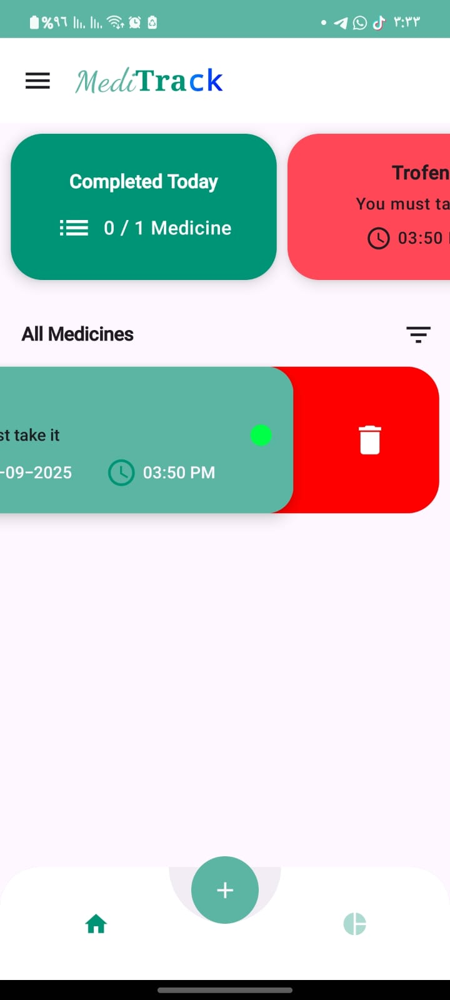

<p align="center">
  
  <h1 align="center">MediTrack</h1>
  <p align="center">Your Ultimate Medication Reminder & Tracker App</p>
</p>

<p align="center">
  <a href="https://github.com/yazanprogrammer1/MediTrack"></a>
  
  
  
</p>

---

## 🌟 About MediTrack

MediTrack helps you **manage your medications efficiently** with:

- Timely reminders  
- A clean, user-friendly interface  
- The ability to **share schedules** with family or doctors  

Perfect for **elderly users** or anyone with **chronic conditions**.

---

## 📸 Screenshots

| Home | Add Medication | Reminder List |
|------|----------------|---------------|
|  |  |  |
|  |  |  |
|  |  |  |
|  |  |  |

---

## ⚡ Features

- 📅 **Schedule reminders** for your medications  
- ⏰ **Timely notifications** with snooze options  
- 👨‍👩‍👧 **Share schedules** with family or doctors  
- 📊 **Track adherence** over time  
- 🎨 **Clean UI** using Jetpack Compose  

---

## 🛠 Tech Stack

| Technology | Icon |
|------------|------|
| **Kotlin** |  |
| **Jetpack Compose** |  |
| **Coil** |  |
| **Hilt (DI)** |  |
| **Coroutines & Flow** |  |
| **Retrofit (API)** |  |

---

## 🚀 Installation

1. **Clone the repository**
```bash
git clone https://github.com/yazanprogrammer1/MediTrack.git
